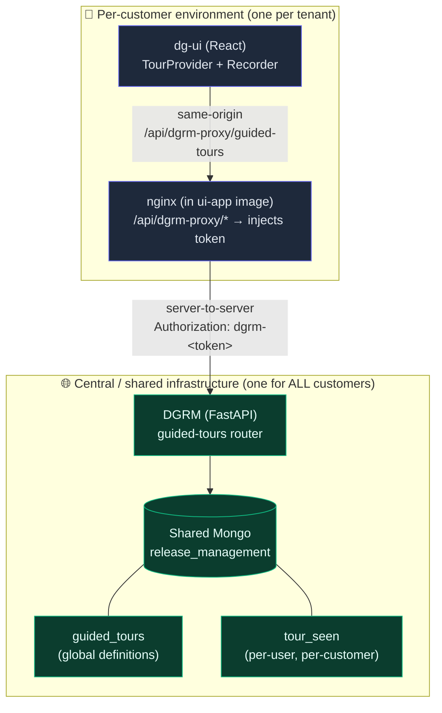
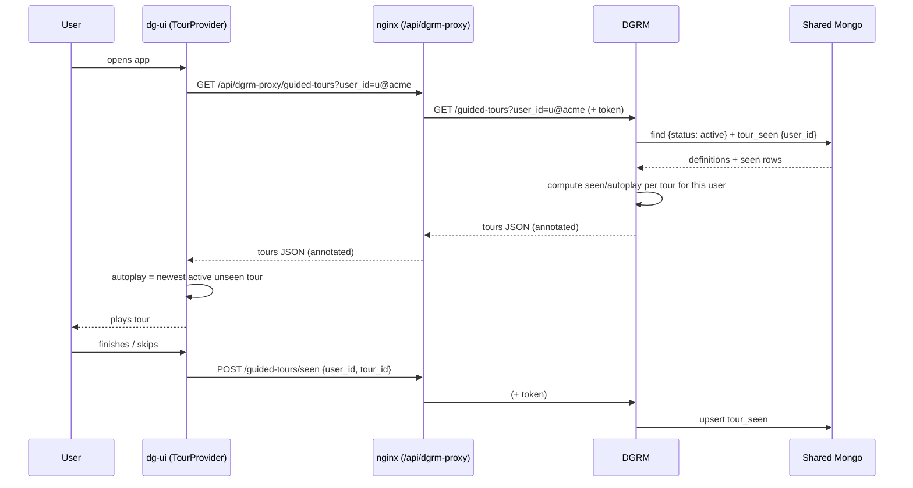
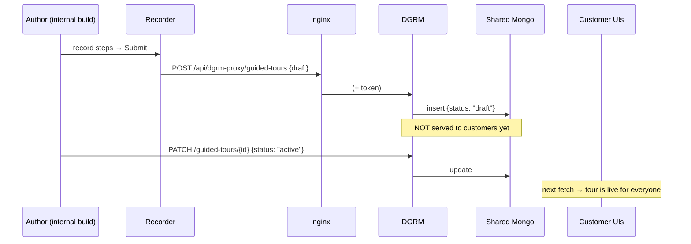
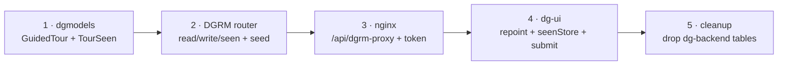
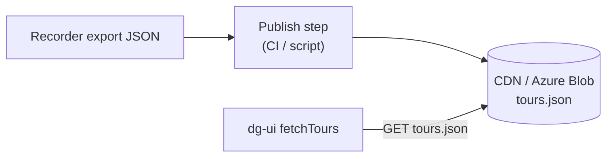

# Dynamic Guided Tours via DGRM — Design & Migration Plan

**Status:** Proposed
**Author:** Guided Tour team
**Last updated:** 2026-06-25

---

## 1. Background & Problem

Release 1 shipped **static, hardcoded tours** baked into the dg-ui bundle
(`src/constants/staticTours.ts`). That was deliberate — it let us ship onboarding
and release tours without any backend. The next phase needs **dynamic tours**:
created from the in-app **recorder**, stored centrally, edited without a UI
release, and served to every customer.

We already prototyped a backend for this in **dg-backend** (FastAPI + SQLModel),
with `guided_tour` + `guided_tour_seen` Postgres tables and a full REST surface.
The problem:

> **dg-backend and its databases are deployed _per customer_.** Shipping the
> tours feature that way means a **DB migration script per customer** to create
> two tables, on every customer environment. Tours are *not* a per-release,
> per-customer concern — they're global content that changes out-of-band. The
> per-customer DB burden is disproportionate and doesn't scale.

### Core insight — two very different data shapes

| Data | Shape | Volatility | Natural home |
|------|-------|-----------|--------------|
| **Tour _definitions_** (title, steps, locators, version) | **Global**, identical for all customers | Changes rarely, out-of-band from releases | A **shared/central** store |
| **"Has user X seen tour Y"** | **Per-user, per-customer** | High-write | A central store keyed by `(customer, user, tour)` |

The whole design follows from keeping these two cleanly separated and **out of
per-customer databases entirely**.

---

## 2. Goals & Constraints

**Goals**
- Store tour definitions **once, centrally** — update a tour → live for all
  customers, **no release, no DB script**.
- Author tours from the **existing recorder** (record → Submit → saved).
- Track per-user "seen / autoplay-once" state, **cross-device**.
- **Minimal** changes to the UI; reuse the `Tour`/`Step` shape we already have.
- Scalable & efficient; keep **future targeting** (per-customer/segment, A/B) open.

**Constraints / "don't violate anything"**
- The UI **cannot talk to DGRM directly** today (no CORS, internal service).
  We reach it via a **token**, mirroring how `react-specter` reaches ClickUp.
- No secret tokens leaked into the JS bundle.
- A customer browser must never be able to silently push live content to *all*
  customers without a gate.
- No new per-customer database objects.

---

## 3. Decisions (locked)

| # | Decision | Choice | Rationale |
|---|----------|--------|-----------|
| 1 | dg-backend topology | **Per-customer** | Confirmed — this is why we leave it. |
| 2 | Definition storage | **DGRM shared Mongo** (`release_management` DB, new `guided_tours` collection) | Already central, scope-based multi-tenancy, version-aware, token auth exists. |
| 3 | Browser → service access | **nginx proxy, token injected server-side** (`/api/dgrm-proxy/…`) | Same-origin → no CORS; token stays out of the JS bundle. Mirrors `specter-proxy`. |
| 4 | Seen-state | **Central `tour_seen` Mongo collection, keyed by `(user_id, tour_id)`** | Cross-device, fully central, no per-customer table. `user_id` (keycloak email) is globally unique, so no tenant column is needed. |
| 5 | Authoring | **Recorder → Submit → `POST` → Mongo**, single router, one token; **UI gates who can author** | Simplest; recorder only ships in internal builds; `draft → active` gate prevents accidental go-live. |

---

## 4. Target Architecture



**The boundary that matters:** everything tour-related that *persists* lives in
the **central** box. The per-customer box only contains stateless UI + an nginx
hop. **Nothing new is deployed to a customer's database.**

---

## 5. Data Model (added to `dgmodels` repo)

### `guided_tours` — global definitions

| field | type | notes |
|-------|------|-------|
| `_id` | `str` (uuid) | tour id |
| `title` | `str` | e.g. `v4.15`, `v4.15-kpioverlay`; UI maps to release notes |
| `type` | `str` | `onboarding` \| `release` \| `feature` |
| `version` | `str \| null` | product version the tour maps to |
| `status` | `str` | `draft` \| `active` \| `archived` |
| `scope` | `list[str]` | **Optional, defaults to `["*"]` (global).** Reserved for *future* targeting — **not used in the read path today.** Tours are global. |
| `steps` | `list[dict]` | array-of-objects (settled shape) |
| `theme` | `dict \| null` | optional per-tour theme override |
| `conditions` | `list` | reserved for future gating |
| `created_by` | `str` | author |
| `created_at` / `updated_at` | `datetime` | |

**Index:** `(scope, status)`.

### `tour_seen` — per-user state

| field | type | notes |
|-------|------|-------|
| `user_id` | `str` | keycloak email/subject — **globally unique**, so it's the only tenant key needed |
| `tour_id` | `str` | |
| `seen_at` | `datetime` | |

**Index:** unique `(user_id, tour_id)`.

> **Hygiene:** keep `tour_seen` as its own collection (optionally its own logical
> DB on the same cluster) so high-write per-user telemetry doesn't muddy
> release-management data.

**Autoplay-once** = "newest `active` tour with **no** `tour_seen` row for this
`user_id`" — the exact logic the dg-backend service already computes; it ports
over directly. The read endpoint computes `seen`/`autoplay` per user at
read-time and returns them on each tour.

---

## 6. API (single DGRM `guided-tours` router)

| Method | Path | Caller | Purpose |
|--------|------|--------|---------|
| `GET` | `/guided-tours?user_id=<email>` | customer UI | active tours, **each annotated with `seen` + `autoplay`** for this user |
| `POST` | `/guided-tours/seen` | customer UI | mark a tour seen `{user_id, tour_id}` |
| `POST` | `/guided-tours` | recorder (internal build) | upsert a tour (lands as `draft`) |
| `PATCH` | `/guided-tours/{id}` | recorder / ops | edit; flip `draft → active` |
| `GET` | `/guided-tours/all` | internal | list incl. drafts |

The read is a **single call**: pass `user_id`, get back the active tours with
per-user `seen`/`autoplay` already computed (no separate seen fetch, no scope).
All endpoints in **one place**, validated by **one token** (the token authorizes
the *UI app*, not a person). **Who can author is a UI concern** — see §9.

---

## 7. Access path — nginx (ships in UI image, not a DB script)

```nginx
location /api/dgrm-proxy/ {
    proxy_pass https://<dgrm-host>/;
    proxy_ssl_server_name on;
    proxy_set_header Host <dgrm-host>;
    proxy_set_header Authorization "dgrm-<tours-token>";   # injected here, NOT in JS bundle
}
```

- Browser calls **same-origin** `/api/dgrm-proxy/…` → **no CORS** needed on DGRM.
- Token is added by nginx → **never in the JS bundle**.
- **One shared token** for all customers — tour content is global and not
  sensitive, so per-customer secrets aren't worth it. The token authorizes the
  *UI app* to reach DGRM; the only per-request input the UI sends is `user_id`.
- If `nginx.conf` isn't already `envsubst`-templated, we template just this token.

---

## 8. Read / Autoplay flow



---

## 9. Authoring / write flow

The recorder is already gated behind `ENABLE_GUIDED_TOUR` and lazy-loaded, so it
**isn't present in customer production builds**. Internal/dev builds show it; on
**Submit** it POSTs the draft.



**Safety net (recommended):** new tours land as `status: "draft"`; the customer
read endpoint serves only `status: "active"`. So a Submit never instantly goes
live for all customers — you flip it to `active` when ready. *(If you prefer
"submit = instantly live", default `status: "active"` — a one-line difference.)*

**Residual trade-off (not a blocker):** one shared token + one shared Mongo means
write capability exists wherever the token does. In practice the authoring UI
ships only in internal builds, and the `draft → active` gate means nothing goes
live unreviewed — blast radius is "someone could create a draft," which is
harmless.

---

## 10. UI changes (small; same `Tour`/`Step` shape)

1. **Repoint** the existing RTK Query tours service base URL
   `/api/backend-service/guided-tours` → `/api/dgrm-proxy/guided-tours`; the read
   already passes `user_id`. Types & hooks largely unchanged.
2. **`fetchTours`** → call the real service instead of returning `STATIC_TOURS`
   (keep the 3 static tours as a **bundled fallback** behind a flag for
   safety/offline).
3. **`seenStore`** → wire `hasSeen / getAll / markSeen` to the `/seen` endpoints
   (replaces the trivial mock).
4. **Recorder Submit** → POST the draft (internal builds only).
5. Release-notes mapping (`matchTourForRelease` by title/version) — **unchanged**.

---

## 11. Cutover / Migration

1. Land `dgmodels` models + DGRM router; **seed the 3 existing static tours**
   into Mongo (one-time CLI insert — DGRM already has a component CLI pattern).
2. Add nginx location + token (template if needed).
3. Flip `fetchTours` / `seenStore` to the service behind `TOURS_ENABLED`; keep
   static fallback.
4. **Drop** the per-customer dg-backend `guided_tour` + `guided_tour_seen`
   tables, endpoints, and migrations → the per-customer DB burden disappears
   permanently.

### Build order (smallest first)



---

## 12. Risks & Mitigations

| Risk | Mitigation |
|------|-----------|
| Shared write token could create unwanted tours | Authoring UI only in internal builds; `draft → active` gate; tours are reviewable content, not code. |
| Per-user writes on release Mongo | Separate `tour_seen` collection / logical DB; indexed; low payload. |
| DGRM has hardcoded Mongo creds + static auth key | Pre-existing; out of scope here, but flag for a follow-up secret-rotation task. Don't widen exposure. |
| nginx token rotation | Single shared token → rotate in one nginx template + DGRM; document it. |
| DGRM down → no tours | UI keeps **bundled static tours as fallback**; tours are non-critical UX. |

## 13. Future scope (kept open)
- **Targeting** via `scope`: per-customer, per-segment, per-environment tours.
- **A/B / staged rollout** via `status` + scope.
- **Analytics** from existing telemetry events (`tour.completed`, `step.viewed`…).
- Cross-device seen — **already delivered** by this design.

---

# Plan B — Alternatives (if the DGRM route is blocked)

If putting tours into DGRM is undesirable (governance: mixing product content
into release-management infra) or blocked, here are real fallbacks, in order of
preference.

### Plan B1 — Static JSON published to CDN / Blob (simplest)



- **Storage:** one `tours.json` (per scope if needed) in a CDN/blob bucket.
- **Read:** UI fetches the file directly (public/cacheable) — no service, no token.
- **Authoring:** recorder **exports** JSON (today's `console.log`); a person/CI
  publishes the file (review gate built in).
- **Seen-state:** **localStorage** (per-device) — no server. Acceptable for
  onboarding nudges; lose cross-device.
- **Pros:** zero new service, trivial, dirt-cheap, globally cached.
- **Cons:** no live write API (publish step), no per-user/cross-device seen, no
  dynamic targeting without baking it into the JSON. **Best if tours change
  rarely and manual publishing is fine.**

### Plan B2 — Tours stored in a shared Mongo behind **dg-backend**

- Keep the **existing dg-ui RTK service unchanged** (`/api/backend-service/guided-tours`).
- Change only dg-backend's tours **storage layer** from per-customer Postgres →
  a **shared/central Mongo** connection.
- **Pros:** **zero UI change**; reuses the endpoints we already built.
- **Cons:** dg-backend is **per-customer**, so each instance must be wired to a
  *shared* Mongo (new cross-cutting connection in a per-customer service);
  couples global content to a per-tenant service. Still **no per-customer
  tables** (the win), but architecturally muddier than DGRM. **Good fallback if
  DGRM can't host but we want minimal UI churn.**

### Plan B3 — Dedicated central "tours" microservice

- A small standalone service (FastAPI) + the same shared Mongo + the same nginx
  proxy pattern — but **not** inside DGRM.
- **Pros:** clean separation of concerns; tours own their service & lifecycle;
  same access/token/seen design as the main plan.
- **Cons:** a new service to build, deploy, and operate. **Choose this if mixing
  tours into DGRM is a governance no-go but we still want a real API + write
  path + cross-device seen.**

### Comparison

| | **Plan A (DGRM)** | B1 (CDN JSON) | B2 (dg-backend + shared Mongo) | B3 (new service) |
|---|---|---|---|---|
| Per-customer DB | ❌ none | ❌ none | ❌ none | ❌ none |
| New service to operate | reuse DGRM | none | reuse dg-backend | **yes** |
| Live write/recorder API | ✅ | ❌ (publish step) | ✅ | ✅ |
| Cross-device seen | ✅ | ❌ (localStorage) | ✅ | ✅ |
| UI change size | small | small | **none** | small |
| Dynamic targeting | ✅ scope | limited | ✅ | ✅ |
| Governance fit | tours in release infra | clean | global data in per-tenant svc | **cleanest** |

**Recommendation:** **Plan A** — it reuses DGRM's shared Mongo, scope tenancy,
versioning, and token auth; gives a live recorder write path and cross-device
seen; and needs only small, well-bounded changes across `dgmodels`, DGRM, nginx,
and dg-ui. Keep **Plan B1 (CDN JSON)** in the back pocket as the
zero-infrastructure fallback.
