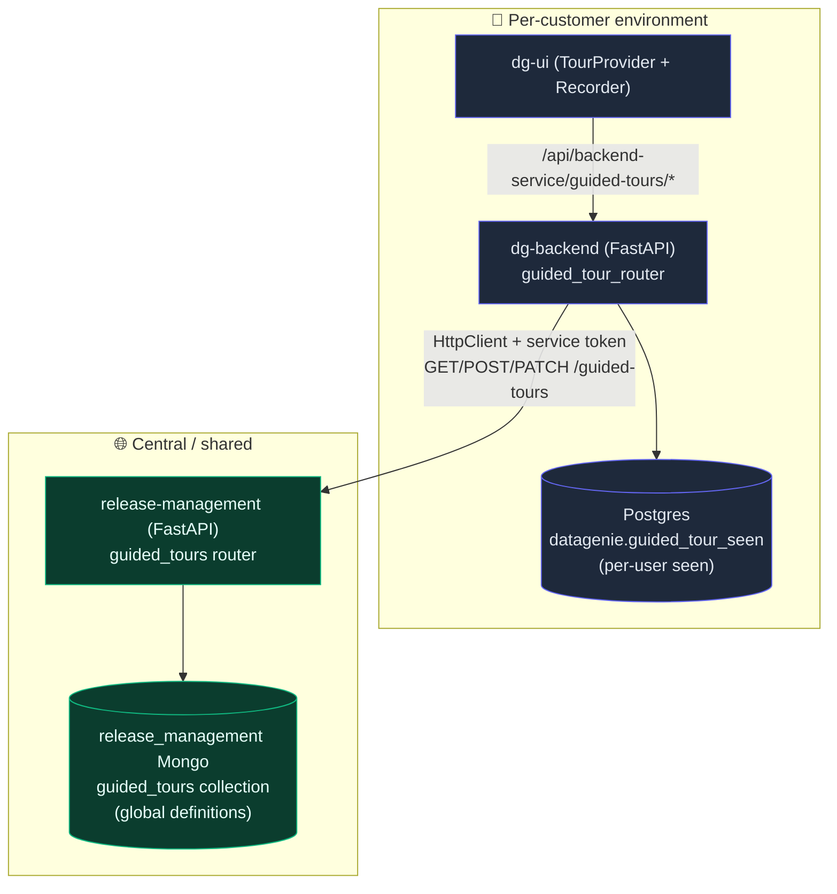
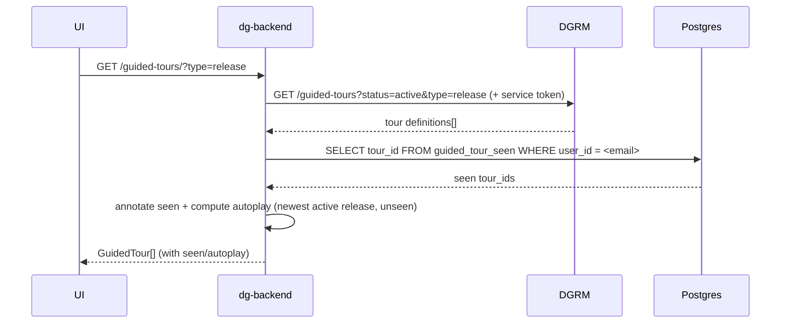
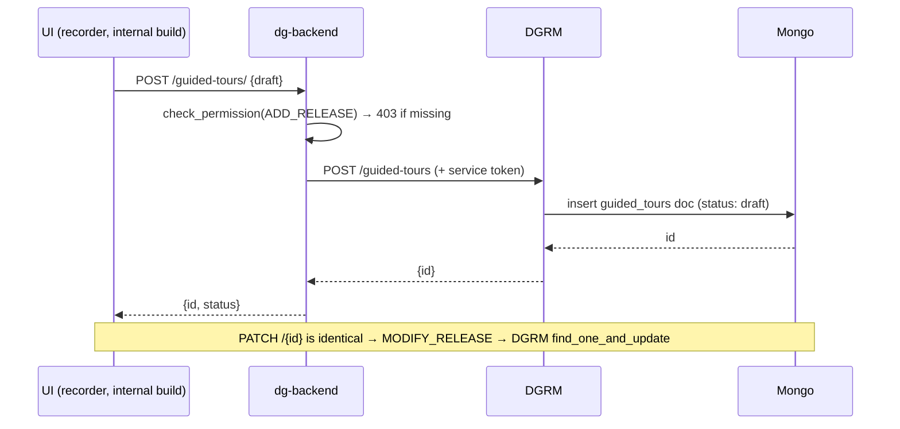
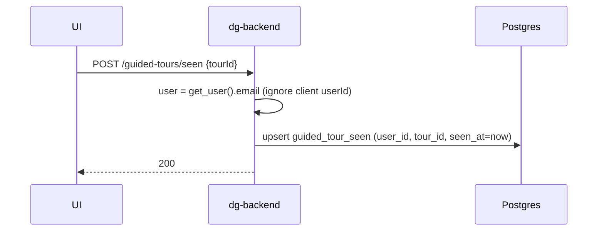

# Guided Tours — Backend Integration SRS

**Status:** Proposed (ready for review → implementation)
**Author:** Guided Tour team
**Last updated:** 2026-06-30
**Supersedes:** the seen-state + access decisions in `DGRM-TOURS-PLAN.md` (that doc put *seen* in central Mongo and reached DGRM via an nginx proxy; this SRS instead puts *seen* in dg-backend Postgres and reaches DGRM through the dg-backend service, matching the pattern a teammate already shipped for release-notes).

---

## 1. Overview

Wrap up dynamic guided tours by giving the existing UI a real backend. Tours split into two data shapes with two different homes:

| Data | Nature | Home | Why |
|------|--------|------|-----|
| **Tour definitions** (title, steps, locators, version, theme…) | Global, identical for all customers, changes out-of-band | **DGRM Mongo** (`release_management` DB, new `guided_tours` collection) | Central, no per-customer deploy; reached through dg-backend, mirroring the teammate's release-notes proxy |
| **Seen state** (`user_id`, `tour_id`, `seen_at`) | Per-user, per-tenant, high-write | **dg-backend Postgres** (`datagenie.guided_tour_seen`) | User-specific — cannot live in shared Mongo; must be tenant-isolated |

dg-backend is the single origin the browser talks to (`/api/backend-service/guided-tours/*`). It **fetches definitions from DGRM**, **stores/reads seen in its own Postgres**, and **joins them** on GET.

### Ground-truth from repo scan (already in place)
- **dg-backend** (`branch be-guidedtour`): `dgrm_proxy.py` factory + `DgrmSettings` (`DGRM_SERVICE_URL`, `DGRM_SERVICE_TOKEN`) + Release-Management permissions (ids 23–26, `can_*_release`, `_permission_mapper`) **all landed**. A permissive CORS middleware is an uncommitted local edit.
- **release-management**: `GET /product/versions` landed (our authed-read template); `SimpleAuth` inline per-handler with a `datagenie-admin` bypass; Mongo CRUD via `MongoArtifactoryManager` + `get_product_orchestrator()`. **No write endpoints yet** — ours are the first.
- **dgmodels**: local; models under `dgmodels/dgrm/`, no shared base class, pin tracks `main`.
- **ui-app**: `guidedTours.service.ts` already defines the exact contract; `fetchTours`/`seenStore` are static today.
- Our earlier Postgres tour prototype is deleted (bytecode-only, unregistered) — we rebuild only the **seen** side.

---

## 2. The four endpoints (browser → dg-backend)

All under `/api/backend-service/guided-tours` (UI RTK service + vite proxy already target this).

| # | Method / path | Handler behaviour | Downstream |
|---|---------------|-------------------|-----------|
| 1 | `GET /guided-tours/?type=&status=` | Fetch definitions from DGRM (**default `status=active`**; the dev drafts panel passes `status=draft`), load caller's seen rows from Postgres, compute `seen`+`autoplay`, return merged `GuidedTour[]` | DGRM (read) **+** Postgres (read) |
| 2 | `POST /guided-tours/` | Forward create to DGRM (writes the `guided_tours` Mongo doc); return `{id}` | DGRM (write) |
| 3 | `POST /guided-tours/seen` | Upsert `(user_id, tour_id, seen_at)` for the **authenticated** user | Postgres (write) |
| 4 | `PATCH /guided-tours/{id}` | Forward partial update to DGRM (`find_one_and_update`) | DGRM (write) |

Plus `GET /guided-tours/{id}` (single fetch — UI has the hook; cheap to include).

> **Only #1 is non-transparent** (proxy + Postgres join). #2/#4 are thin forwards to DGRM; #3 is pure Postgres. Because of the join and the fixed `/guided-tours/` path, this is a **purpose-built `guided_tour_router`**, not the transparent `build_proxy_router` factory (which stays dedicated to release-notes). It still reuses `DgrmSettings` + `HttpClient` + the Release-Management permission checks.

**Identity:** the UI sends `userId` (its keycloak email), but dg-backend uses **`get_user().email` as the source of truth** for both the seen write and the GET join — the client-supplied `userId` is ignored/validated, never trusted for whose seen-state to touch.

---

## 3. Architecture



**The per-customer footprint is exactly one small table** (`guided_tour_seen`). Everything structural (the tours themselves) is central. This is the deliberate, accepted reversal of the earlier "nothing per-customer" stance — justified because seen-state is inherently user+tenant data.

---

## 4. Repo-by-repo changes

### 4.1 dgmodels — the `GuidedTour` model (decision point)

**Option A (recommended for speed): local DTO in release-management** — define `GuidedTour` as a Pydantic model *inside* the DGRM API/service layer (precedent: `VersionInfo` in `product.py`). Avoids the cross-repo `dgmodels` change + `main` re-pin round-trip. Promote to `dgmodels` later if another service needs it.

**Option B: add to `dgmodels/dgrm/guided_tour.py`** — the "proper" shared-model home, but requires merge-to-`main` + re-lock in DGRM before it's usable.

Either way the model:
```python
class GuidedTour(BaseModel):            # subclass BaseModel directly — NOT ReleaseItem
    id: str                             # uuid4 string
    title: str
    type: str                           # 'onboarding' | 'release'  (or TourType StrEnum)
    version: str | None = None          # e.g. "v4.16" — NOT semver-validated
    status: str = "draft"               # 'draft' | 'active' | 'archived'
    scope: list[str] = ["*"]            # future targeting; default global
    steps: list[dict] = []
    theme: dict | None = None
    conditions: list[dict] = []
    created_by: str | None = None
    created_at: datetime | None = None
    updated_at: datetime | None = None
```
> Do **not** inherit `ReleaseItem` — its `@field_validator("version")` enforces semver and would reject `"v4.16"`. Optional `TourType`/`TourStatus` StrEnums in `enum_store.py`.

### 4.2 release-management (DGRM) — the `guided_tours` collection + CRUD

Mirror the Product stack (`API → orchestrator → manager → MongoArtifactoryManager → MongoDBConnector`):

| File | Change |
|------|--------|
| `services/guided_tour.py` (new) | `GuidedTourManager(db)` with `GUIDED_TOURS_COLLECTION = "guided_tours"`: async `_afetch_tours(type, status)` (via `db.aquery`) + `fetch_tours` (via `make_async_call_safe`); `add_tour` (`insert`, sets id/created_at); `update_tour` (`find_one_and_update`, always `$set updated_at`); `get_tour(id)`. |
| `services/orchestrator.py` | `get_guided_tour_orchestrator()` factory calling `get_default_db()` (mirror `get_component_orchestrator` — the lighter, manager-direct pattern; no ReleaseManager needed). |
| `api/guided_tour.py` (new) | `guided_tour_router = APIRouter(prefix="/guided-tours")`: `GET /` (list, optional `?type=` & `?status=` — default `active`), `GET /{id}`, `POST /` (create), `PATCH /{id}` (update). Each repeats the inline guard `SimpleAuth(scope); auth.validate_token(token)`. |
| `api/main.py` | `app.include_router(guided_tour_router)`. **No CORS needed** (dg-backend calls server-to-server). |
| CLI | Optional — skip for now (API-first feature). |

**DGRM auth:** dg-backend always sends a `datagenie-admin`-scoped `dgrm-<hex>` token, so all tour routes validate cleanly regardless of `?scope`. Reads and writes both require a valid token (no anonymous access to DGRM).

**Mongo doc** = the `GuidedTour` shape above; `_id` = `id`.

### 4.3 dg-backend — seen table + service + router

**(a) Postgres model (2-layer SQLModel, `datagenie` schema):**
- `models/base/guided_tour_seen.py` → `GuidedTourSeenBase(SQLModel)`: `user_id: str` (PK), `tour_id: str` (PK), `seen_at: datetime` (default UTC now).
- `models/tables/guided_tour_seen.py` → `GuidedTourSeenTable(GuidedTourSeenBase, table=True)`, `metadata = SQLMODEL_METADATA`, `__tablename__ = "guided_tour_seen"`.
- **Drop the old Postgres `guided_tours` definitions table entirely** — it lives in DGRM now.

**(b) Migration — `db-scripts` repo (`/Users/samarth/Desktop/dg-repos/db-scripts`, `master`):**
The repo now uses **semantic `X.Y.sql`** patches (date-named `YYYYMMDD_NN.sql` are the old scheme). Latest semantic on `master` = **`2.3.0.sql`**.
> ⚠️ **Dependency:** the teammate's **`2.3.1.sql` (Release-Management perms, ids 23–26) is NOT yet merged to `master`.** It is a **prerequisite** — we gate tour writes on `ADD_RELEASE`/`MODIFY_RELEASE`, whose permission *rows* that patch seeds. Our patch is the next free number **after** it (`2.3.2.sql`) and must be applied after 2.3.1.

`db-scripts/patches/postgres/2.3.2.sql` (repo style — txn + `db_scripts` audit row):
```sql
BEGIN TRANSACTION;
CREATE TABLE IF NOT EXISTS datagenie.guided_tour_seen (
    user_id   VARCHAR(255) NOT NULL,
    tour_id   VARCHAR(255) NOT NULL,
    seen_at   TIMESTAMPTZ  NOT NULL DEFAULT now(),
    PRIMARY KEY (user_id, tour_id)
);
INSERT INTO datagenie.db_scripts (name, description, author)
VALUES ('2.3.2.sql', 'Add guided_tour_seen table (per-user tour seen state)', '<you>@datagenie.ai');
COMMIT;
```
> This is the **one per-customer migration**. `user_id` = **email** (consistent with `privileges.user_id == user.email`).

**(c) Service — `services/guided_tour.py`:**
- Uses an `HttpClient(base_url=settings.dgrm.service_url)` + `Authorization = settings.dgrm.service_token` to call DGRM `/guided-tours`.
- `list_tours(user_email, type, status="active")` → GET DGRM defs (passing `status`); load seen set from `guided_tour_seen where user_id = user_email`; annotate each tour `seen` and compute `autoplay` (newest **active** `release` tour that's unseen — the recovered `_compute_autoplay_id` logic).
- `mark_seen(user_email, tour_id)` → upsert `guided_tour_seen` row.
- `create_tour(body)` / `update_tour(id, body)` → forward to DGRM (POST/PATCH), return `{id, message, status}`.
- `get_tour(id)` → GET DGRM single.

**(d) Dependency:** `dependencies.py` → `get_guided_tour_service` (session factory + `app_settings.dgrm` + an `HttpClient`). *(This dependency was referenced by the deleted prototype and must be re-created.)*

**(e) Router — `api/guided_tour.py`:** `guided_tour_router = APIRouter(prefix="/guided-tours")`, depends on `get_guided_tour_service` + `get_user`:
- `GET /` (`type`, `status` — default `active`) → `list_tours(get_user().email, type, status)`; the dev drafts panel passes `status=draft`
- `GET /{id}`
- `POST /` → **requires `ADD_RELEASE`** (`security_guard.check_permission`), then `create_tour`
- `PATCH /{id}` → **requires `MODIFY_RELEASE`**, then `update_tour`
- `POST /seen` → `mark_seen(get_user().email, body.tourId)` — authenticated self-write, no special permission

**(f) `main.py`:** add `guided_tour_router` to the `routers` (protected) list.

**RBAC decision:** reuse the already-landed **Release-Management** perms (`ADD_RELEASE`/`MODIFY_RELEASE`) for tour writes — no new seed. Rationale: writes hit shared Mongo (affect all customers) so they must be admin-gated, and the recorder ships only in internal builds anyway. *Alternative:* a dedicated Tour permission group (next free id **27**) via a new db-scripts seed — cleaner semantically, more work. **Recommend reuse now.**

### 4.4 ui-app — flip static → backend (localized)

The RTK service and vite proxy already exist. Changes in `src/layout/index.jsx`:
1. Import `useListToursQuery` + `useMarkTourSeenMutation`.
2. `fetchTours` → return `useListToursQuery({ userId, type }).data` instead of `STATIC_TOURS` (keep static as a bundled fallback behind a flag).
3. `seenStore` → `markSeen` via `useMarkTourSeenMutation` (`POST /seen`); derive `hasSeen`/`getAll` from the `seen` flag on fetched tours.
4. `handleSubmit` (recorder) → uncomment `upsertTour(...)` (`POST /`).
5. **Release banner** (`ReleaseTourBanner`) → drive from backend `seen`/`autoplay` instead of localStorage + `LATEST_RELEASE_TOUR`. (localStorage stays the offline fallback.)
6. **Tours management panel** (internal build only) → see §4.5.

### 4.5 Draft review & publish — simple, UI-gated

No special endpoint, no read-side permission. Drafts are handled entirely by a **dev-only "Draft tours" section in the UI**, gated exactly like the recorder (`VITE_ENABLE_GUIDED_TOUR`), so customers never render it and thus never see drafts.

1. **Fetch:** the drafts section calls `GET /guided-tours/?status=draft` — a plain query param, **no RBAC** (draft content isn't sensitive and the section is build-gated). The customer path just uses the default `status=active`.
2. **Preview:** each draft row has **▶ Preview** → `startTour(id)` (status-independent; also works right after recording via the id `POST` returns).
3. **Make live:** a **"Make live"** button → `PATCH /{id} {status:"active"}` (the one gated write, `MODIFY_RELEASE`). Optional **Archive** → `PATCH /{id} {status:"archived"}`.

This can live in the same dev surface as the recorder / the existing `ReleaseNotesPanel` dev tools.

**Key decoupling:** a tour's `status` (draft→active) is independent of whether release notes for its `version` are published. So you record → preview → make live whenever you're ready — the draft is always visible to its creator in the dev section, never blocked by release notes, and never exposed to customers (the default `active`-only fetch + the build-gated section).

---

## 5. Sequence flows

**GET (the join):**


**POST tour (create) & PATCH (update):**


**POST seen (Postgres only):**


---

## 6. Auth & security summary
- **Browser → dg-backend:** standard keycloak bearer (existing). GET + POST-seen: any authenticated user. POST/PATCH tour: `ADD_RELEASE`/`MODIFY_RELEASE`.
- **dg-backend → DGRM:** `datagenie-admin` `dgrm-<hex>` service token (`DGRM_SERVICE_TOKEN`), server-to-server → no CORS, token never in the browser.
- **Seen writes** always key on `get_user().email`, never the client-supplied `userId`.
- **Pre-existing risk (flag, out of scope):** DGRM's `SimpleAuth` key/nonce are hardcoded in `settings.py`; the service token is long-lived. Don't widen exposure; consider rotation as a follow-up.

---

## 7. Rollout / migration order
1. **DGRM**: add `GuidedTour` (local DTO) + `GuidedTourManager` + `guided_tour_router`; deploy. Seed the current static tours into Mongo (one-time script/API calls).
2. **db-scripts**: author `2.3.2.sql` (`guided_tour_seen`); apply per customer.
3. **dg-backend** (`be-guidedtour`): seen model + service + dependency + router + `main.py`; set `DGRM_SERVICE_URL`/`DGRM_SERVICE_TOKEN`; deploy. Decide the CORS edit (keep only if genuinely cross-origin; prefer removing the `allow_origins=["*"]` before merge).
4. **ui-app**: flip `fetchTours`/`seenStore`/recorder submit/banner from static → service behind a flag; keep static fallback for one release.
5. Verify: GET returns tours with correct `seen`/`autoplay`; recorder submit creates a DGRM doc; seen persists across devices (Postgres).

---

## 8. Resolved decisions ✅
1. **`GuidedTour` model home** → **Local DTO in DGRM** (Pydantic model inside release-management, like `VersionInfo`). No `dgmodels` change / re-pin.
2. **Write RBAC** → **Reuse `ADD_RELEASE` (POST) / `MODIFY_RELEASE` (PATCH)** — no new permission seed.
3. **Draft gate** → **New tours land as `status:"draft"`**; GET serves only `active`; flip to active (via PATCH) when ready.
4. **Autoplay ownership** → **Computed in dg-backend GET** (it holds seen state).
5. **dg-backend CORS** → **Keep** the permissive middleware — it's intentional, enabling the local dg-backend ↔ UI connection during dev.

---

## 9. Testing
- **DGRM**: `tests/test_api.py` — CRUD on `guided_tours` (create → list → patch → get), token required.
- **dg-backend**: `tests/api/test_guided_tour.py` — GET join (mock DGRM HttpClient + seeded seen rows → correct `seen`/`autoplay`); seen upsert idempotency; POST/PATCH permission gating (403 without grant); identity uses `get_user().email`.
- **ui**: fetchTours reads service; seen mutation fires on complete/skip; banner reflects backend `autoplay`.
